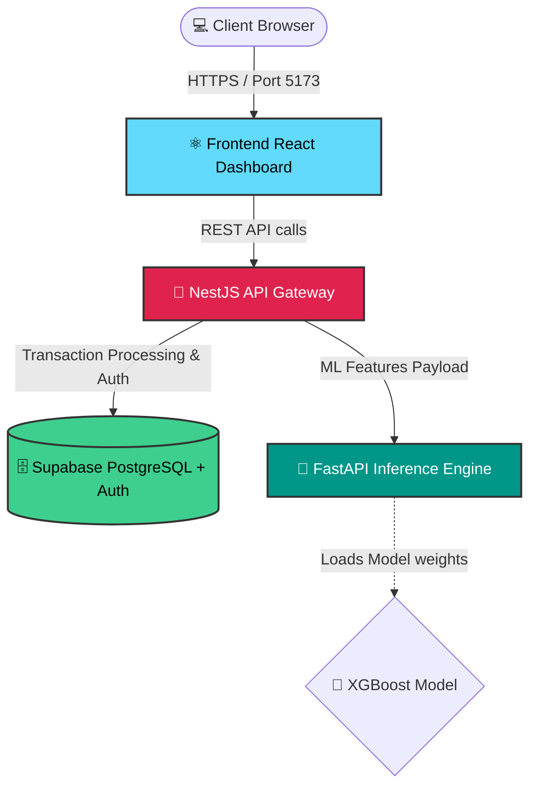

# FraudShield AI 🛡️

FraudShield AI is an intelligent, real-time SaaS platform designed to detect, analyze, and prevent fraudulent transactions. Built with a modern microservices architecture, it seamlessly scales to offer high-performance machine learning inference and beautiful analytics dashboards.

---

## 🏗️ Architecture

FraudShield utilizes a robust three-tier microservices architecture consisting of a React Vite frontend, a NestJS API Gateway, and a FastAPI inference engine.



---

## 🌊 System Flow

1. **Transaction Submission**: A user, merchant, or POS system submits transaction details.
2. **Gateway Verification**: The `gateway-nestjs` verifies the JWT token, securely parses the payload, and logs the raw `Transaction` to Supabase.
3. **Feature Engineering**: The Gateway extracts critical quantitative features representing the transaction metadata.
4. **Machine Learning Inference**: The Gateway passes the engineered features over to the `ml-backend-fastapi` service. The XGBoost model immediately scores the transaction, returning a `fraud_probability` and binary `label`.
5. **Real-time Alerting**: If the probability exceeds our risk threshold (>0.80), the system dispatches an `Alert` entity to Supabase.
6. **Dashboard Monitoring**: The frontend React dashboard dynamically polls or subscribes to the endpoints to immediately notify analysts via the high-risk transaction widget.

---

## 📚 API Documentation

### Gateway API (NestJS)
Base URL: `http://localhost:3000`

| Endpoint | Method | Auth Required | Description |
|----------|--------|---------------|-------------|
| `/auth/login` | POST | No | Authenticate and retrieve JWT payload |
| `/transactions` | POST | Yes | Process and score a new transaction |
| `/transactions` | GET | Yes | Retrieve user transaction history |
| `/transactions/high-risk` | GET | Yes | Retrieve specifically fraudulent transactions |
| `/analytics/fraud-rate` | GET | Yes | Global rate of intercepted fraud vs safe flow |
| `/analytics/trend` | GET | Yes | Trailing 30-day time-series data for charting |
| `/alerts` | GET | Yes | Live polling endpoint for high-risk threat alerts |

### ML Inference API (FastAPI)
Base URL: `http://localhost:8000` (Internal)

| Endpoint | Method | Auth Required | Description |
|----------|--------|---------------|-------------|
| `/predict` | POST | No (Internal) | Accepts feature tensors and returns fraud prediction |

---

## 📸 Screenshots

> **Note**: Store your final production dashboard screenshots in the `docs/` folder.


---

## 🚀 Getting Started

You can deploy the entire microservice ecosystem locally using Docker Compose.

### 1. Configure Environments
Clone the repository and copy the example environment file:
```bash
cp .env.example .env
```
Fill out `.env` with your active Supabase keys and JWT configuration.

### 2. Launch Services
Use Docker Compose to build and bind all multi-stage containers:
```bash
docker-compose up --build -d
```

### 3. Access the Application
- **Frontend Dashboard**: `http://localhost:5173`
- **Gateway API**: `http://localhost:3000`
- **ML API Status**: `http://localhost:8000/docs`
